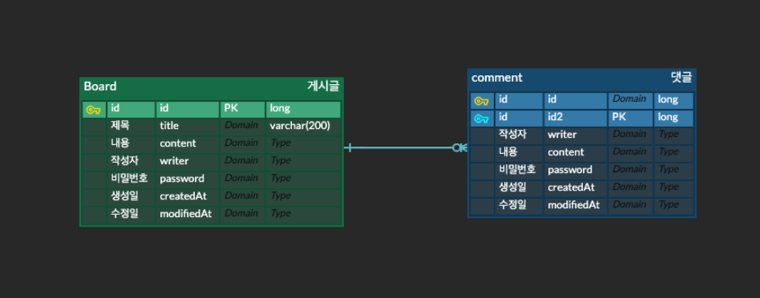

# micro SNS

## 목차
- [목표](#목표)
- [개발환경](#개발환경)
- [기능 구현 목록](#기능-구현-목록)
- [기능 상세 설명](#기능-상세-설명)
- [ERD](#erd)
- [테스트 방법](#테스트-방법)

---

## 목표

### 1. JDBC
### 2. Spring JDBC
### 3. Sprint Data JPA

위 3가지를 이용해 마이크로 SNS 서비스를 구현합니다.

---

## 개발환경
- Srping Boot 3.4.4
- JAVA 17
- MySQL

---

## 기능 구현 목록

- [x] 게시글 쓰기
- [x] 게시글 상세조회
- [x] 게시글 수정
- [x] 게시글 삭제
- [x] 게시글 목록 조회
- [x] 댓글 작성(대댓글x)
- [x] 무한스크롤방식

- [x] 위 기능 JDBC로 구현
- [x] 위 기능 Spring JDBC로 구현
- [x] 위 기능 Spring Data JPA로 구현

---

## 기능 상세 설명

- 회원기능은 없습니다
- 게시글 쓰기
  - 닉네임, 비밀번호를 입력한다. 빈 문자열은 불가능하다.
  - 제목, 내용을 입력한다. 빈 문자열은 불가능하다.
- 게시글 상세조회
  - 선택한 게시글에 대해 상세조회한다.
- 게시글 수정
  - 수정 버튼을 누르면 비밀번호를 입력하고, 게시글 작성시 입력한 비밀번호와 비교한다.
  - 일치할 경우 수정 창으로 이동한다.
  - 비밀번호, 제목, 내용을 수정할 수 있다. 빈 문자열은 불가능하다.
- 게시글 삭제
  - 삭제 버튼을 누르면 비밀번호를 입력하고, 게시글 작성시 입력한 비밀번호와 비교한다.
  - 일치할 경우 삭제한다.
  - hard delete
- 게시글 목록 조회
  - 무한 스크롤 방식
- 댓글 작성
  - 닉네임, 비밀번호를 입력한다. 빈 문자열은 불가능하다.
  - 내용을 입력한다. 빈 문자열은 불가능하다.

---

## ERD

---

## 테스트 방법

applicaiton.yml에서 spring.active.profiles의 설정에 따라
구현 방식을 바꿀 수 있습니다.

아래 3가지 옵션을 통해 바꿀 수 있습니다.
- jdbc
- springjdbc
- jpa

